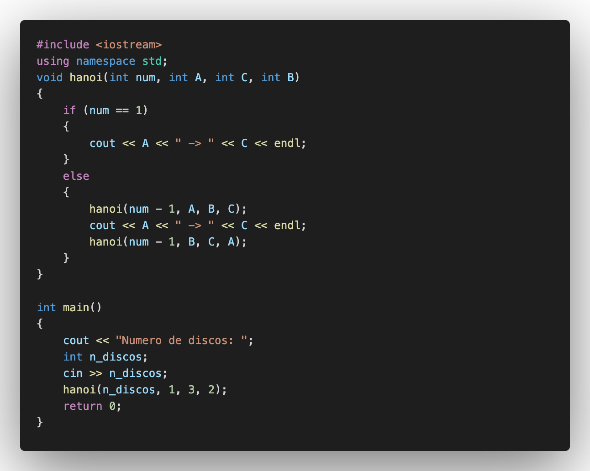
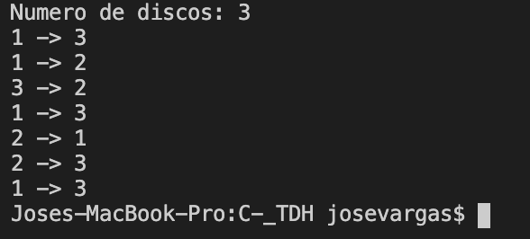

# C++\_TDH

## :copyright: Autor

- :older_man: **Jose Fernando Vargas Rodriguez**
- :e-mail: jose.vargasr@unitec.edu
- :link: [github.com/josevargasr](https://github.com/josevargasr)
- :calendar: 2020-09-15 23:00 CST

---

## :dart: Objetivos

Un programa de **C++** diseñado para demostrar:

1. Utilizar librerias de C++ para representar gráficamente el problema.
2. Crear un algorítmo para el famoso problema "Torres de Hanoi".
   

---

## Ejercicio

### TDH_2

### Salida

## :computer: Código

- :blue_book: [C++\_TDH](https://github.com/josevargasr/C-_TDH.git)

---

#### Herramientas:

- :package: [Visual Studio Code](https://code.visualstudio.com/)
- :camera: [Polacode-2020 v0.5.2](https://github.com/jeff-hykin/polacode)
- :notebook: [Markdown Cheatsheet](https://github.com/adam-p/markdown-here/wiki/Markdown-Cheatsheet)
- :smile: [Emoji Cheat Sheet](https://www.webfx.com/tools/emoji-cheat-sheet/)
